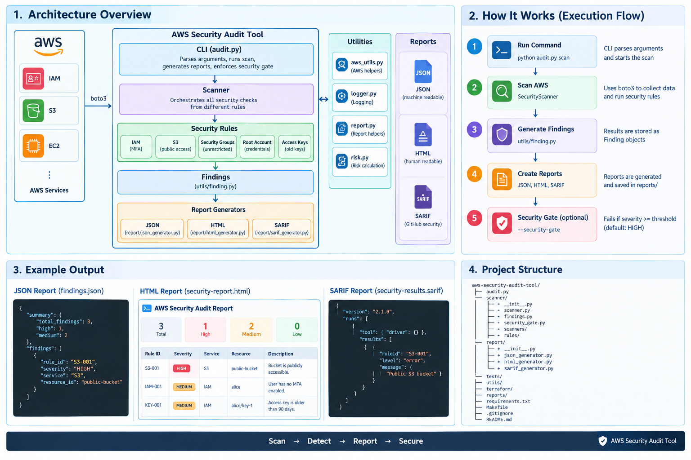

# AWS Security Audit Tool

A Python-based AWS security auditing tool that scans common AWS configurations for security risks and generates JSON, HTML, and SARIF reports.

The project is designed as a practical security and DevSecOps project for learning and demonstrating:

* AWS security auditing
* IAM security
* S3 security
* Security Group analysis
* Access key hygiene
* Root account security
* Infrastructure as Code with Terraform
* Automated testing with Pytest
* Security gates in CI/CD
* SARIF integration with GitHub
* Python project structure and automation

---

## Features

### 🔐 IAM Security

Checks IAM users for missing Multi-Factor Authentication (MFA).

**Rule:**

```text
IAM-001
```

Severity:

```text
MEDIUM
```

---

### 🪣 S3 Security

Checks S3 buckets for public access.

The scanner examines:

* S3 Public Access Block configuration
* Bucket policy status
* Bucket ACL configuration

**Rule:**

```text
S3-001
```

Severity:

```text
HIGH
```

---

### 🌐 Security Group Security

Checks AWS Security Groups for unrestricted inbound access.

For example:

```text
0.0.0.0/0
```

The scanner can identify rules that expose ports such as:

```text
22
80
443
```

**Rule:**

```text
SG-001
```

Severity:

```text
HIGH
```

---

### 👑 Root Account Security

Checks AWS account-level information for root account credentials.

The scanner checks whether the account summary indicates:

* Root access keys
* Root console password

Rules:

```text
ROOT-001
ROOT-002
```

Severity:

```text
CRITICAL
```

---

### 🔑 Access Key Security

Checks IAM credential reports for old active access keys.

The default maximum age is:

```text
90 days
```

**Rule:**

```text
KEY-001
```

Severity:

```text
MEDIUM
```

---

## Security Gate

The project includes a security gate that can be used in CI/CD pipelines.

Example:

```bash
python audit.py scan --security-gate
```

By default, the security gate fails when a finding has severity:

```text
HIGH
```

or higher.

Severity levels:

```text
INFO
LOW
MEDIUM
HIGH
CRITICAL
```

You can also specify a different threshold:

```bash
python audit.py scan --security-gate --minimum-severity MEDIUM
```

The command returns:

```text
0 → Security gate passed
1 → Security gate failed
2 → Scanner execution error
```

This makes the scanner suitable for automated DevSecOps workflows.

---

# Architecture

The project follows a modular structure where the CLI, scanner orchestration, security rules, reporting, utilities, tests, and infrastructure are separated.



---

# How the Project Works

The overall flow is:

```text
                 ┌─────────────────┐
                 │    audit.py     │
                 │   CLI Entry     │
                 └────────┬────────┘
                          │
                          ▼
                 ┌─────────────────┐
                 │ SecurityScanner │
                 └────────┬────────┘
                          │
             ┌────────────┼────────────┐
             │            │            │
             ▼            ▼            ▼
          IAM Rule      S3 Rule     SG Rule
             │            │            │
             ├────────────┼────────────┤
             │
             ▼
       Root / Key Rules
             │
             ▼
          Findings
             │
       ┌─────┼─────┐
       ▼     ▼     ▼
      JSON  HTML  SARIF
             │
             ▼
       Security Gate
             │
        ┌────┴────┐
        ▼         ▼
      PASS       FAIL
```

---

# Technology Stack

| Technology     | Purpose                      |
| -------------- | ---------------------------- |
| Python         | Security scanner             |
| Boto3          | AWS API interaction          |
| AWS IAM        | Identity and access auditing |
| AWS S3         | Bucket security auditing     |
| AWS EC2        | Security Group auditing      |
| Terraform      | Security test infrastructure |
| Pytest         | Automated testing            |
| GitHub Actions | CI/CD                        |
| SARIF          | Security result integration  |
| HTML           | Human-readable report        |
| JSON           | Machine-readable report      |
| Make           | Developer automation         |

---

# Prerequisites

Before running the project, install:

* Python 3.12+
* AWS CLI
* Terraform 1.6+
* Git

You also need AWS credentials configured locally.

Verify Python:

```bash
python --version
```

Verify AWS CLI:

```bash
aws --version
```

Verify Terraform:

```bash
terraform version
```

---

# AWS Authentication

The scanner uses the AWS credentials available to the AWS SDK.

For example:

```bash
aws configure
```

Then provide:

```text
AWS Access Key ID
AWS Secret Access Key
Default region name
Output format
```

Verify your credentials:

```bash
aws sts get-caller-identity
```

The command should return your AWS account information.

> Never commit AWS credentials, access keys, secret keys, `.env` files, Terraform state, or other secrets to Git.

---

# Installation

Clone the repository:

```bash
git clone <your-repository-url>
```

Move into the project:

```bash
cd aws-security-audit-tool
```

Create a virtual environment:

```bash
python -m venv .venv
```

Activate it on Windows PowerShell:

```powershell
.venv\Scripts\Activate.ps1
```

Activate it on Linux/macOS:

```bash
source .venv/bin/activate
```

Install dependencies:

```bash
pip install -r requirements.txt
```

---

# Running the Scanner

Run a normal security scan:

```bash
python audit.py scan
```

The scanner will inspect the configured AWS account and generate security findings.

Reports are generated under:

```text
reports/
```

Expected report formats:

```text
reports/
├── findings.json
├── security-report.html
└── security-results.sarif
```

---

# Running with Security Gate

Run:

```bash
python audit.py scan --security-gate
```

The default threshold is:

```text
HIGH
```

Therefore:

```text
INFO       → Pass
LOW        → Pass
MEDIUM     → Pass
HIGH       → Fail
CRITICAL   → Fail
```

You can change the threshold:

```bash
python audit.py scan \
  --security-gate \
  --minimum-severity MEDIUM
```

---

# Reports

The scanner produces three report formats.

## JSON Report

The JSON report is intended for:

* Automation
* CI/CD systems
* Programmatic processing
* Further analysis

Example structure:

```json
{
  "summary": {
    "total_findings": 1,
    "high": 1
  },
  "findings": [
    {
      "rule_id": "S3-001",
      "severity": "HIGH",
      "service": "S3"
    }
  ]
}
```

---

## HTML Report

The HTML report provides a human-readable security report.

It contains information such as:

* Rule ID
* Severity
* Service
* Resource
* Description
* Remediation

Open the generated HTML file in a browser to inspect the results.

---

## SARIF Report

SARIF stands for:

```text
Static Analysis Results Interchange Format
```

The project generates a SARIF 2.1.0 report so security findings can be consumed by security tooling and GitHub code-scanning workflows.

Example:

```text
security-results.sarif
```

---

# Terraform Security Lab

The project includes a Terraform-based test environment.

The purpose is to create controlled resources that intentionally contain security issues so that the scanner can be tested against real AWS infrastructure.

The Terraform lab includes:

### Public S3 Bucket

Expected finding:

```text
S3-001
HIGH
```

### IAM User Without MFA

Expected finding:

```text
IAM-001
MEDIUM
```

### Open Security Group

Expected finding:

```text
SG-001
HIGH
```

The Terraform configuration does **not** intentionally create:

* EC2 instances
* Root credentials
* IAM access keys

This keeps the test environment smaller and avoids creating unnecessary credentials.

---

# Terraform Setup

Move into the Terraform directory:

```bash
cd terraform
```

Initialize Terraform:

```bash
terraform init
```

Validate the configuration:

```bash
terraform validate
```

Format Terraform files:

```bash
terraform fmt
```

Review the infrastructure plan:

```bash
terraform plan
```

Create the test resources:

```bash
terraform apply
```

After confirming the resources are intended for testing, destroy them:

```bash
terraform destroy
```

---

# Terraform Test Cases

The expected test cases are documented in:

```text
terraform/TEST_CASES.md
```

The intended flow is:

```text
Terraform
    │
    ▼
Create intentionally insecure lab resources
    │
    ▼
Run AWS Security Audit Tool
    │
    ▼
Detect security findings
    │
    ▼
Generate reports
    │
    ▼
Run security gate
    │
    ▼
Destroy test resources
```

> Use the Terraform environment only in an AWS account where you are authorized to create and test these resources.

---

# Automated Testing

The project uses `pytest`.

Run all tests:

```bash
python -m pytest -v
```

The test suite covers:

* IAM MFA detection
* Public S3 detection
* Security Group detection
* Root account checks
* Old access key detection
* Security gate behavior
* JSON report generation
* HTML report generation
* SARIF report generation

The tests use fake AWS clients rather than requiring a live AWS account.

This allows the unit tests to run without creating AWS resources.

---

# Makefile

The project includes a `Makefile` for common development commands.

Install dependencies:

```bash
make install
```

Run tests:

```bash
make test
```

Run the scanner:

```bash
make scan
```

Run the security gate:

```bash
make security-gate
```

Clean generated files:

```bash
make clean
```

On Windows, the commands can also be executed directly with Python if `make` is not installed.

---

# CI Pipeline

GitHub Actions is used to automatically validate the project.

The CI workflow performs:

```text
Checkout
   │
   ▼
Setup Python
   │
   ▼
Install dependencies
   │
   ▼
Run Pytest
   │
   ▼
Setup Terraform
   │
   ▼
Terraform Format Check
   │
   ▼
Terraform Init
   │
   ▼
Terraform Validate
```

Workflow:

```text
.github/workflows/ci.yml
```

---

# AWS Security Integration

The repository also contains a GitHub Actions workflow for running the scanner against an AWS security test environment.

Workflow:

```text
.github/workflows/security-integration.yml
```

The workflow can:

1. Check out the repository
2. Configure AWS credentials using GitHub OIDC
3. Install Python dependencies
4. Initialize Terraform
5. Create the test infrastructure
6. Run the security scanner
7. Generate SARIF and other reports
8. Upload security results
9. Upload reports as workflow artifacts
10. Destroy the Terraform test infrastructure
11. Enforce the security gate

The integration workflow is manually triggered using:

```text
workflow_dispatch
```

---

# GitHub OIDC

The GitHub Actions security integration workflow is designed to use AWS IAM role assumption through GitHub OIDC rather than storing long-lived AWS access keys in GitHub Secrets.

The workflow expects the repository variable:

```text
AWS_ROLE_ARN
```

to contain the IAM role ARN used by GitHub Actions.

The relevant permissions include:

```yaml
permissions:
  id-token: write
  contents: read
  security-events: write
```

This approach avoids placing permanent AWS access keys directly in the GitHub repository configuration.

---

# Security Rules

Current rules include:

| Rule ID    | Check                                  | Severity |
| ---------- | -------------------------------------- | -------- |
| `IAM-001`  | IAM user without MFA                   | MEDIUM   |
| `S3-001`   | Public S3 bucket                       | HIGH     |
| `SG-001`   | Security Group allows `0.0.0.0/0`      | HIGH     |
| `ROOT-001` | Root account access key detected       | CRITICAL |
| `ROOT-002` | Root account console password detected | CRITICAL |
| `KEY-001`  | Old active IAM access key              | MEDIUM   |

---

# Project Design

The project separates responsibilities into different modules.

### `audit.py`

CLI entry point.

Responsible for:

* Parsing command-line arguments
* Starting scans
* Generating reports
* Running the security gate

### `scanner/`

Contains the scanning logic.

### `scanner/rules/`

Contains individual security rules.

For example:

```text
iam.py
s3.py
security_groups.py
root_account.py
access_keys.py
```

### `scanner/scanners/`

Contains higher-level scanner wrappers.

For example:

```text
root_scanner.py
```

### `report/`

Responsible for generating:

```text
JSON
HTML
SARIF
```

### `utils/`

Contains reusable helper functionality:

```text
aws_utils.py
finding.py
logger.py
report.py
risk.py
```

### `tests/`

Contains automated unit tests.

### `terraform/`

Contains the infrastructure used for controlled security testing.

---

# Example Workflow

A typical local workflow looks like:

```bash
# Clone repository
git clone <your-repository-url>

# Enter project
cd aws-security-audit-tool

# Create environment
python -m venv .venv

# Activate environment
.venv\Scripts\Activate.ps1

# Install dependencies
pip install -r requirements.txt

# Run tests
python -m pytest -v

# Validate Terraform
terraform -chdir=terraform init
terraform -chdir=terraform validate

# Create security test environment
terraform -chdir=terraform apply

# Run scanner
python audit.py scan

# Run security gate
python audit.py scan --security-gate

# Destroy test environment
terraform -chdir=terraform destroy
```

---

# Example Finding

A finding can contain information such as:

```text
[HIGH] S3-001 - Public S3 bucket

Resource:
public-test-bucket

Service:
S3

Description:
The S3 bucket is publicly accessible.

Remediation:
Enable S3 Block Public Access and review
bucket policies and ACLs.
```

---

# Security Considerations

This project is intended for security auditing and controlled testing.

Do not run infrastructure tests against AWS resources that you do not own or have explicit permission to assess.

The Terraform configuration intentionally creates insecure resources for testing purposes.

Before using the project in a real AWS environment:

* Review IAM permissions
* Review AWS costs
* Review Terraform resources
* Use a dedicated test account where possible
* Avoid storing credentials in the repository
* Use temporary credentials or IAM roles
* Destroy test resources after testing

---

# Limitations

This tool is a learning and portfolio project and is not intended to replace a full AWS security platform.

Current checks cover a limited set of AWS security configurations.

It does not currently provide comprehensive coverage of:

* All IAM policies
* All S3 configurations
* CloudTrail configuration
* AWS Config
* KMS key policies
* VPC flow logs
* GuardDuty
* Security Hub
* EKS security
* Lambda security
* RDS security
* Complete CIS AWS Benchmark coverage

Additional security rules can be added to the `scanner/rules/` directory.

---

# Future Improvements

Potential improvements include:

* Additional AWS security rules
* CIS AWS Benchmark mapping
* AWS Security Hub integration
* CloudTrail auditing
* KMS auditing
* VPC and subnet checks
* RDS security checks
* Lambda security checks
* Config rule integration
* Improved HTML dashboard
* Risk scoring
* Parallel scanning
* Configuration file support
* Additional CI/CD integrations
* More comprehensive integration tests

---

# License

This project is licensed under the MIT License.

See:

```text
LICENSE
```

for the complete license text.

---

# Author

**Pushkar Narayan**

Software Developer | Cloud & DevOps | Software Testing & Automation

GitHub:

```text
https://github.com/Pnarayan-3
```

---

# Disclaimer

This project is intended for educational, development, and authorized security-auditing purposes.

Always ensure that you have appropriate authorization before scanning or modifying AWS resources.

⭐ If you find this project useful, consider giving the repository a star.